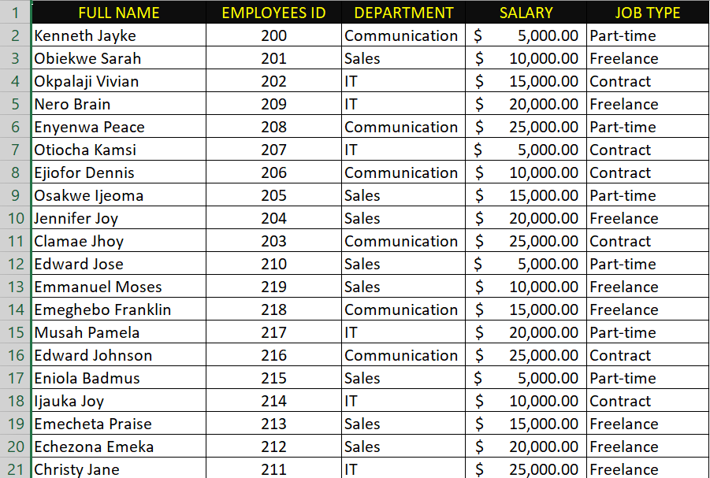
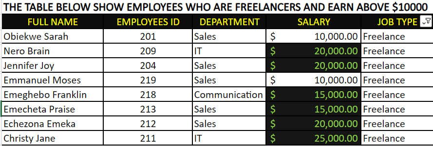
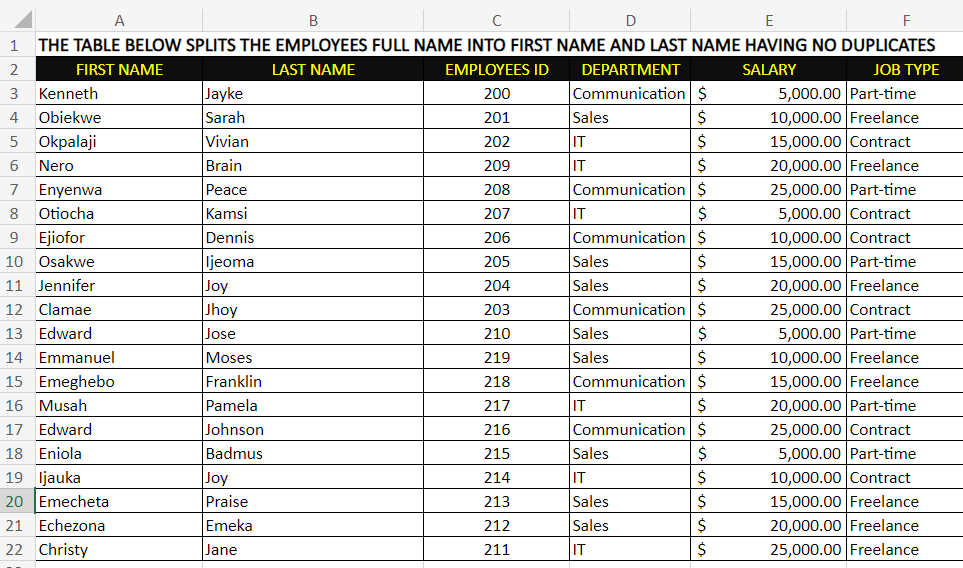
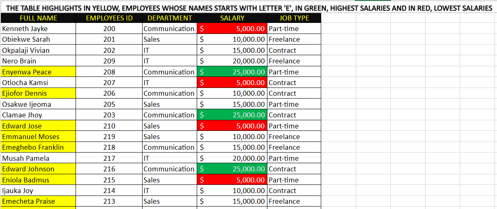

# EMPLOYEE DATA ANALYSIS
## INTRODUCTION
This is an Excel task on an employee dataset designed to provide a robust solution for handling and analyzing employee data in a corporate environment. The analysis consists of four(4) strategically crafted worksheets, each tailored to address specific aspects of employee information.

**_Disclaimer_** : The dataset does not portray any specific company, institution, or country. Instead, it is a personalized, generated dataset crafted solely for the purpose of showcasing the capabilities of Excel.

## PROBLEM STATEMENT
In the first worksheet, generate a table with 20 rows of data, incorporating key fields such as Employee ID, Employee Full Name, Department, Salary, and Job Type. Subsequently, copy and paste this table into worksheet two(2), worksheet(3) and worksheet(4).
The tasks within worksheet two(2), three(3) and four(4) are as follows:
### Worksheet 2: Filtering Freelancers and Salary Emphasis
- Display only Freelancer employees.
- Emphasize individuals whose salaries exceed $10,000.
### Worksheet 3: Name Splitting and Duplicate Identification
- Split the employees' full names into first names and last names.
- Identify and highlight any duplicate entries without removing them.
### Worksheet 4: Name Filtering and Salary Formatting
- Highlight employees whose names begin with the letter 'E' using a yellow background.
- Format the Salary column to visually represent the highest salary with a green background and the lowest salary with a red background.

## SKILLS
The following Excel functionalities were implemented:
- Input and editing of data
- Conditional formatting
- Data filtering
- Text-to-columns operation

## RESULTS AND DISCUSSION
### Worksheet 1: 
The provided snapshot below displays a table containing 20 rows of generated employee information, including full names, employees ID, departments, salaries, and job types. The skills of input and data editing were applied during this session.

### Worksheet 2:
The image below showcases freelancers among employees whose salaries exceed $10,000. This outcome was accomplished through the utilization of data filtering and conditional formatting features. To achieve this, I began by highlighting the **Job_type** column and activating the filter. Then, narrowed down to freelancers by unchecking other job types. Next, I highlighted the **Salary** column, navigated to the home icon on the Excel ribbon, and accessed conditional formatting. Setting rules for salaries above $10,000, and applying a green color for highlighting

### Worksheet 3:
The following image displays a table where full names have been splitted into first names and last names, with no duplicates identified, resulting in no highlights. The text-to-columns Excel functionality facilitated this operation. Initially, two empty columns were inserted next to the full name column to avoid disrupting other columns in the table. Subsequently, the full name column was highlighted, and the text-to-columns feature, located in the data icon on the Excel ribbon, was employed. By selecting the delimited option, I proceeded through the steps, specifying the text separator and completing the process. As a result, the employee full names transformed from a single column to two separate columns representing first names and last names.

### Worksheet 4: 
The below displayed table highlights employees whose names commence with the letter 'E' using a yellow background. It also utilizes the conditional formatting feature in Excel to format the Salary column, representing the highest salary with a green background and the lowest salary with a red background. This was achieved by individually highlighting the full name and salary columns, navigating to the home icon, and selecting conditional formatting. Rules were set to identify employees with names starting with 'E', the highest salary, and the lowest salary, highlighting them with a yellow background, green background, and red background, respectively.

## RECOMMENDATIONS:
The completion of this task, has demonstrated a robust integration of Excel functionalities to efficiently manage and analyze employee data. The application of features such as data filtering, conditional formatting, and text-to-columns showcases a high level of proficiency in data manipulation. Moving forward, I recommend the implementation of this solution in real-world scenarios within organizational data management processes.

## CONCLUSIONS:
In conclusion, **Employee data analysis taks** successfully achieved its objectives of creating a structured employee dataset, filtering and analyzing specific information, and presenting the data in a visually informative manner. The seamless integration of Excel features has enhanced the efficiency of managing and deriving insights from the simulated employee data. This task serves as a valuable example of how Excel can be leveraged to streamline data-related tasks, providing actionable insights for better decision-making within an organizational context.

